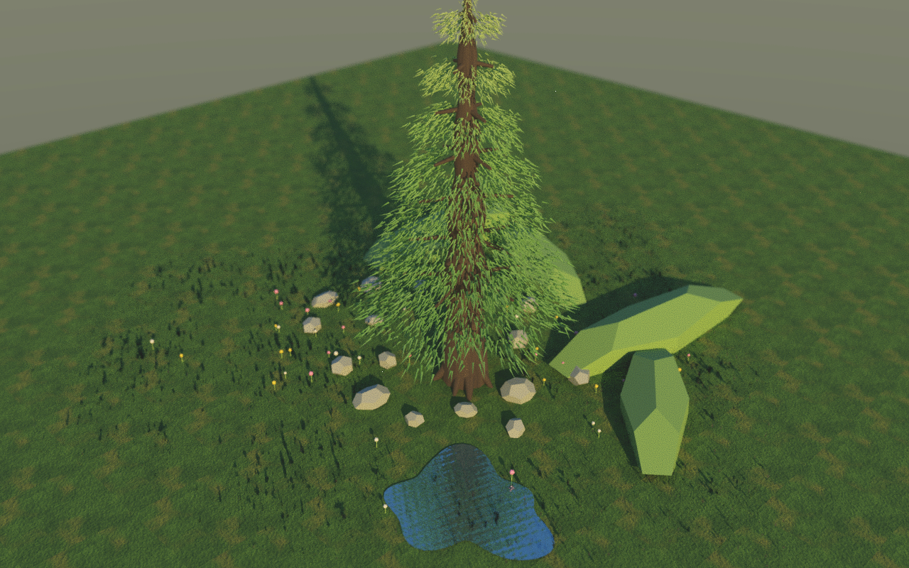

# Pixel Bonsai

A 3D pixel-art bonsai scene rendered in real time with Three.js. A large layered
cedar sits in a hand-styled meadow with a reflective pond — now with a full
**day–night cycle**, **weather** (rain that ripples the pond and splashes the
ground), **wind** that sways the grass and foliage, **wildlife** that wanders in,
a **developmental tree-growth** animation, and a **photoreal path-tracing** mode —
all rendered through a low-resolution, cel-shaded, outline pipeline for a clean
pixel-art look.

The rendering style is inspired by David Holland's write-up on 3D pixel art
rendering (<https://www.davidhol.land/articles/3d-pixel-art-rendering/>); every
technique here is an independent Three.js implementation.


## Demo

| Day–night cycle (moonlit night) | Rain + pond ripples & splashes |
| --- | --- |
|  |  |

| Wildlife wanders the meadow | Photoreal path trace |
| --- | --- |
|  |  |

**Tree growth** — bare twigs → leaves fill in (sparse → dense) → the full cedar:

| ① twigs + first buds | ② crown fills in | ③ full cedar |
| --- | --- | --- |
|  |  |  |

## Modes

Switch modes from the top of the on-screen panel:

- **Real-time** — the full living scene: day–night cycle, weather, wind, wildlife.
- **Growth** — the cedar develops from a twig sprout into the full tree (a looping,
  parametric developmental morph). Grass, flowers, animals and birds fill in as it grows.
- **Morph** — a textbook morph-target version of the growth (every vertex is
  interpolated between a sapling and a mature key-shape).
- **Path Trace** — a photoreal GPU path-tracer showcase of the same tree: HDR
  sky+sun environment, real 3D foliage, detail-textured ground/bark, a near-mirror
  rippled lake, and a pixel-art post pass.

## Quick start

```bash
cd 01_webgl_tree
npm install
npm run dev        # open http://localhost:5173 (use --host to expose on your LAN)
```

Build a static bundle with `npm run build` (output in `01_webgl_tree/dist/`).
Path Trace needs WebGL2; it accumulates samples over time and converges fastest
on a real GPU.

## What's in the renderer

The whole scene is drawn into a small render target (default 300px tall) and
upscaled with nearest-neighbour sampling, so everything reads as crisp pixels.

**Pixel-art pipeline**
- **Low-res pipeline** — color + depth + view-normal targets, post passes, then a
  nearest upscale to the canvas.
- **Pixel-perfect camera** — snaps to a view-aligned texel grid; the final image
  is shifted back by the sub-pixel snap error, so panning stays smooth.
- **Cel shading + cloud shadows** — toon gradient ramp; a scrolling noise texture
  is injected into every material as soft cloud shadows.
- **Outlines** — depth/normal edge detection for single-pixel outlines.
- **Planar-reflection water**, **volumetric god rays**, **dust motes**, plus 2D
  film grain and vignette.

**Atmosphere & life** (this integration)
- **Day–night cycle** — a keyframed sky/fog/sun gradient with an arcing sun (so
  shadows rotate). Deep night stays a visible *moonlit blue* rather than black,
  and the god rays fade out at night and in rain.
- **Weather** — rain as gentle, sparse, wind-slanted streaks with an overcast
  grade and procedural rain ambience. Raindrops **ripple the pond** (perturbing
  the reflection) and pop **splash rings** across the ground and water.
- **Wind** — a shared uniform sways the grass and foliage billboards across the
  whole scene (gustier while it rains).
- **Wildlife** — low-poly cows, sheep and a dog walk *in from off-screen* (eased,
  facing their direction of travel, legs trotting) and a small flock of birds
  glides in. They only appear in clear daylight and head back out at night / in
  rain. Grass, flowers, animals and birds all fill in with the tree's growth.

**Tree growth** ([`02_tree_growth`](02_tree_growth/))
- A parametric developmental morph of the *same* cedar: it first puts out a spray
  of bare twigs, then leaves bud and fill the crown as a smooth coherent wave
  (sparse → dense) while the crown opens out, ending exactly as the scene's tree.

**Path tracing** ([`03_ray_tracing`](03_ray_tracing/))
- A photoreal GPU path tracer (three-gpu-pathtracer + three-mesh-bvh): HDR sky+sun
  environment, depth-of-field hero framing, real 3D foliage clumps (not flat
  cards), detail textures (grass/bark/water normals), and a rippled near-mirror
  lake, finished with a pixel-art post chain.

## Controls

The on-screen panel toggles every effect and lets you change the vertical
resolution and outline strength live:

`Camera drift` · `Texel snap` · `Outlines` · `Cloud shadows` · `Water reflect`
· `God rays` · `Dust motes` · `Rain` · `Day cycle` · `Night` · `Film grain`

(`Day cycle` runs the automatic sun arc; turn it off to use the static `Night` toggle.)

## Project structure

This is a team project. The real-time WebGL tree is the shared subject; the two
other folders build on the same tree for different goals. For team development
conventions (mode plugin contract, shared `ctx`, tree API, git/ownership rules)
see [`CONTRIBUTING.md`](CONTRIBUTING.md).

```text
ICG_Final/
├── 01_webgl_tree/    # real-time WebGL Pixel Bonsai (Three.js + Vite) — the base
│                     #   + day-night, weather, wind, wildlife
├── 02_tree_growth/   # growth morphing: twig sprout -> full cedar
├── 03_ray_tracing/   # photoreal path-traced showcase of the same tree
└── docs/             # screenshots and notes
```

The cedar (trunk, root system, layered foliage skirts) is generated procedurally
in [`01_webgl_tree/src/scene/tree.js`](01_webgl_tree/src/scene/tree.js) and is
parameterised by a single scale factor — the basis for the growth animation.
