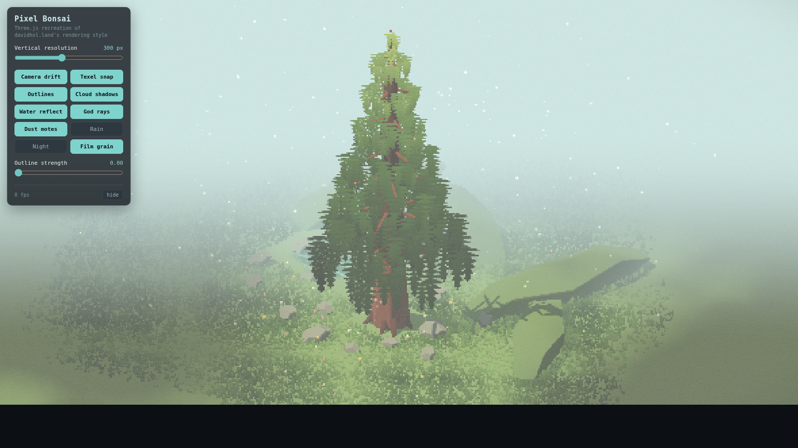
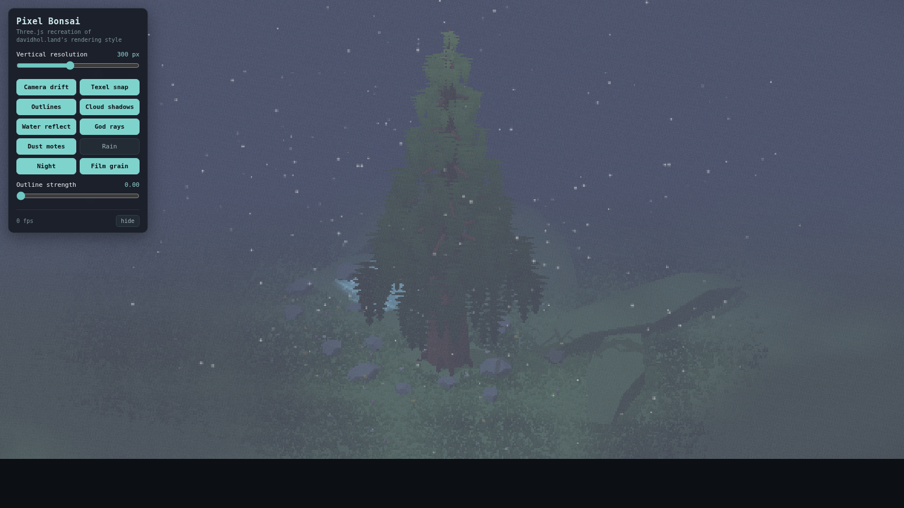

# Pixel Bonsai

A 3D pixel-art bonsai scene rendered in real time with Three.js. A large layered
cedar sits in a hand-styled meadow with a reflective pond, drifting cloud
shadows, volumetric god rays, and floating dust motes — all rendered through a
low-resolution, cel-shaded, outline pipeline for a clean pixel-art look.

The rendering style is inspired by David Holland's write-up on 3D pixel art
rendering (<https://www.davidhol.land/articles/3d-pixel-art-rendering/>); every
technique here is an independent Three.js implementation.


| Daytime drift | Night mode |
| --- | --- |
|  |  |

## Project structure

This is a team project. The real-time WebGL tree is the shared subject; the two
other folders build on the same tree for different goals.

```text
ICG_Final/
├── 01_webgl_tree/    # real-time WebGL Pixel Bonsai (Three.js + Vite) — the base
├── 02_tree_growth/   # growth morphing: small sapling -> full tree (teammate)
├── 03_ray_tracing/   # ray-traced lighting of the same tree (teammate)
└── docs/             # screenshots and notes
```

## Quick start (WebGL tree)

```bash
cd 01_webgl_tree
npm install
npm run dev        # open http://localhost:5173
```

Build a static bundle with `npm run build` (output in `01_webgl_tree/dist/`).

## What's in the renderer

The whole scene is drawn into a small render target (default 300px tall) and
upscaled with nearest-neighbour sampling, so everything reads as crisp pixels.

- **Low-res pipeline** — color + depth + view-normal targets, then post passes,
  then a nearest upscale to the canvas.
- **Pixel-perfect camera** — the camera snaps to a view-aligned texel grid and
  the final image is shifted back by the sub-pixel snap error, so panning stays
  smooth instead of swimming.
- **Cel shading + cloud shadows** — toon gradient ramp; a scrolling noise texture
  is injected into every material as soft cloud shadows.
- **Outlines** — depth/normal edge detection (4-tap kernel) for single-pixel
  outlines with warm highlights on convex, light-facing edges.
- **Planar-reflection water** — a mirrored camera renders reflections; animated
  wave lines and a soft, organic shoreline.
- **Volumetric god rays** — screen-space light shafts that fan from the sun and
  are occluded by the tree and terrain.
- **Dust motes** — additive world-space particles drifting in the air for depth.
- **2D touches** — animated rain, film grain, vignette, and a night colour grade.

## Controls

The on-screen panel toggles every effect and lets you change the vertical
resolution and outline strength live:

`Camera drift` · `Texel snap` · `Outlines` · `Cloud shadows` · `Water reflect`
· `God rays` · `Dust motes` · `Rain` · `Night` · `Film grain`

The cedar (trunk, root system, and layered foliage skirts) is generated
procedurally in [`01_webgl_tree/src/scene/tree.js`](01_webgl_tree/src/scene/tree.js)
and is parameterised by a single scale factor — useful for the growth work.
