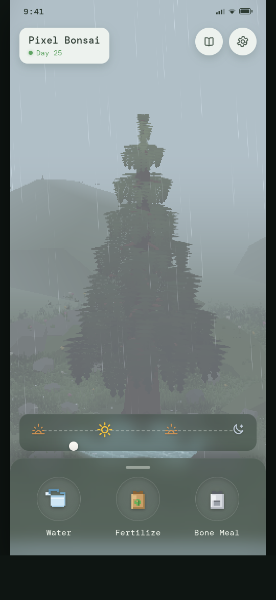

# Pixel Bonsai

A little **3D pixel-art tree-growing game**, rendered in real time with Three.js.
You raise a tree from a Day-1 sprout into a towering cedar over 30 days — watering
and fertilising it, watching the sun arc through a full **day–night cycle**, and
weathering the **rain** (which ripples the pond and splashes the ground). It plays
in a phone-shaped portrait UI, and the whole scene is drawn through a low-resolution,
cel-shaded, outlined pipeline for a clean pixel-art look.

Under the hood it's also a small graphics showcase: the same scene can be viewed in
several **technical modes** — staged tree growth and textbook morph-target morphing —
reachable from the in-game Settings panel. (A photoreal GPU path-tracer mode has been
retired to [`legacy/`](legacy/) for this version.)

The rendering style is inspired by David Holland's write-up on 3D pixel art
rendering (<https://www.davidhol.land/articles/3d-pixel-art-rendering/>); every
technique here is an independent Three.js implementation.


## The game

The default experience is a self-running little garden in a phone-portrait HUD:

- **Grow a tree, day by day.** A day counter advances on its own; the tree
  continuously morphs from a sprout (Day 1) to its full form (Day 30), and the
  meadow's wildlife wanders in as it matures.
- **Tend it.** Tap **Water**, **Fertilize**, or **Bone Meal** on the bottom sheet.
  Water brings a passing shower; fertiliser and bone meal give a growth spurt.
- **Time of day.** A day/night slider lets you scrub from sunrise → noon → sunset →
  night; left alone, the sun cycles on its own and the lighting grades smoothly.
- **Weather.** Showers roll in at random (and on Water) — rain streaks, **pond
  ripples**, **ground splash rings**, and procedural rain ambience.
- **Pick a tree.** Settings → *Tree* switches species: a procedurally-grown
  **billboard cedar** or a **morph-target** sprout→cone tree.
- **Journal.** The book button logs events (rain, a deer visiting, your actions).

The slider/sheet collapse with the grabber to reveal the full scene; the gear opens
**Settings** (graphics options, resolution, tree species, and the technical modes).

## Demo

| Day–night cycle (moonlit night) | Rain + pond ripples & splashes |
| --- | --- |
|  |  |

**Raise the tree, day by day** — a Day-1 sprout → the crown fills in → the full cedar:

| Day 3 | Day 11 | Day 27 |
| --- | --- | --- |
|  |  |  |

## Quick start

```bash
cd 01_webgl_tree
npm install
npm run dev        # open http://localhost:3000 (already runs with --host for your LAN)
```

Open the LAN URL on a phone for the full-screen portrait experience. Build a static
bundle with `npm run build` (output in `01_webgl_tree/dist/`).

## Modes

The game is the default mode. Open **Settings → Mode** to switch (or deep-link with
`?mode=realtime` / `growth` / `growthmorph`):

- **Game** — the tree-raising game described above (real-time pipeline + game clock).
- **Real-time** — the full living scene with no game layer: day–night cycle, weather,
  wind, wildlife.
- **Growth** — the cedar develops from a twig sprout into the full tree (a looping,
  parametric developmental morph). Grass, flowers, animals and birds fill in as it grows.
- **Morph** — a textbook morph-target version of the growth (every vertex is
  interpolated between a sapling and a mature key-shape).

## What's in the renderer

The whole scene is drawn into a small render target (default 540px tall) and
upscaled with nearest-neighbour sampling, so everything reads as crisp pixels.

**Pixel-art pipeline**
- **Low-res pipeline** — color + depth + view-normal targets, post passes, then a
  nearest upscale to the canvas.
- **Pixel-perfect camera** — snaps to a view-aligned texel grid; the final image
  is shifted back by the sub-pixel snap error, so panning stays smooth. Drag
  horizontally to orbit (yaw) around the tree.
- **Cel shading + cloud shadows** — toon gradient ramp; a scrolling noise texture
  is injected into every material as soft cloud shadows.
- **Outlines** — depth/normal edge detection for single-pixel outlines.
- **Planar-reflection water**, **volumetric god rays**, **dust motes**, plus 2D
  film grain and vignette.

**Atmosphere & life**
- **Day–night cycle** — a keyframed sky/fog/sun gradient with an arcing sun (so
  shadows rotate). Deep night stays a visible *moonlit blue* rather than black,
  and the god rays fade out at night and in rain. In Game mode the cycle is driven
  by the game clock / time slider.
- **Weather** — rain as gentle, sparse, wind-slanted streaks with an overcast
  grade and procedural rain ambience. Raindrops **ripple the pond** (perturbing
  the reflection) and pop **splash rings** across the ground and water.
- **Wind** — a shared uniform sways the grass and foliage billboards across the
  whole scene (gustier while it rains).
- **Wildlife** — low-poly cows, sheep and a dog walk *in from off-screen* and a
  small flock of birds glides in. They appear in clear daylight and head back out
  at night / in rain, and stagger in with the tree's growth.

**Game layer** ([`01_webgl_tree/src/modes/game.js`](01_webgl_tree/src/modes/game.js))
- A clock advances the day counter and feeds a continuous growth value to the chosen
  tree; the time-of-day, random weather and Water/Fertilize/Bone Meal actions all
  hook into the existing lighting, rain and growth systems.

**Tree growth** ([`02_tree_growth`](02_tree_growth/))
- **Parametric developmental morph** of the *same* cedar: bare twigs first, then
  leaves bud and fill the crown as a smooth wave while it opens out — ending exactly
  as the scene's tree. Reused by the Game's "cedar" species via
  [`cedar_growth.js`](02_tree_growth/src/cedar_growth.js).
- **Morph-target tree** ([`morph_tree.js`](02_tree_growth/src/morph_tree.js)) — a
  dedicated sprout↔mature mesh whose every vertex is linearly interpolated (the
  "morph" species / Morph mode).

**Path tracing** — *retired to [`legacy/03_ray_tracing`](legacy/03_ray_tracing/) for
this version.* A photoreal GPU path tracer (three-gpu-pathtracer + three-mesh-bvh) of
the same tree; kept for reference but not wired into the current build.

## Project structure

This is a team project. The real-time WebGL tree is the shared subject; the two
other folders build on the same tree for different goals. For team development
conventions (mode plugin contract, shared `ctx`, tree API, git/ownership rules)
see [`CONTRIBUTING.md`](CONTRIBUTING.md).

```text
ICG_Final/
├── 01_webgl_tree/    # real-time WebGL Pixel Bonsai (Three.js + Vite) — the game + base
│                     #   mobile game UI, day-night, weather, wind, wildlife
├── 02_tree_growth/   # growth morphing: twig sprout -> full cedar (+ morph-target tree)
├── legacy/
│   └── 03_ray_tracing/   # retired photoreal path-traced showcase (not in this build)
└── docs/             # screenshots and notes
```

The cedar (trunk, root system, layered foliage skirts) is generated procedurally
in [`01_webgl_tree/src/scene/tree.js`](01_webgl_tree/src/scene/tree.js) and is
parameterised by a single scale factor — the basis for the growth animation.
